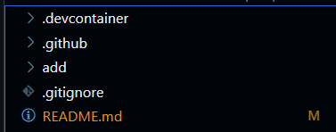

# Rust SQLite Demo Repository

## Setup
Be sure to start with this template repository:

https://github.com/johncoogan53/Rust-Template

Once you have made a new repository and launched a codespace you will see these files:

I have made this template so that it comes with base CI/CD functionality. A quick note, the dockerfile is as bare bones as it can get to ensure that a rust developer environment is set up. Please add as you see fit to include any QOL options you want.

To be sure that this worked, you will want to check if cargo is installed with:

>cargo --version

If you don't see a version number then you should troubleshoot by running:

>curl --proto '=https' --tlsv1.2 -sSf https://sh.rustup.rs | sh

and following the instructions.

You will see an add project directory, this is a placeholder. You will make your own project by using 

>cargo new \<project name>

Lets start by typing:

>cargo new sqlite

This will give you a new project directory:

Rust automatically generates the project structure which is really nice. We will need to add a lib.rs to hold our logic where our main will handle CLI parsing. 

You may not see a target folder or a Cargo.lock file right away and that's fine. The Cargo.toml file is where you can specify dependencies like a requirements.txt file only better. You can include dependencies by adding them with cargo (no need to worry about pinning versions, cargo takes care of it):

>cargo add \<dependency name>

lets start with the dependencies we know we will need, rusqlite for db operations and clap for command line tooling:

>cargo add clap --features derive

we include derive as a feature so we can access traits included in the library (don't worry too much about this now)

>cargo add rusqlite

>cargo add csv 

for csv ingestion

And our Cargo.toml file now has our dependencies:

## Side note about builds

Rust is a compiled language and so to run programs you will need to compile the file first. This is done a few ways:

>cargo check

* a quick compile that works off of a cached version to only rebuild changes

>cargo build

* an unoptimized build which has debug functionality

>cargo build --release

* generates an optimized binary in your target/release/\<projectname> directory

This binary location is also what gets uploaded as an artifact in the template's yml file. Be sure to update the working directory location and binary location name for this to work properly.

## Project Breakdown

Our main.rs file will handle our CLI features by parsing input as one of three options: Create, Query, Delete since Query can handle reads and updates. Feel free to add more. 

See main.rs for a commented example of how we make our CLI. Note that by using clap over standard library options (std::env for rust or argparse for python) we get a lot of free functionality like help menu guides:

Before you begin taking a look at the code, be sure to add your compiled binary (--release) to your path, this way you can use your CLI normally without using:

>cargo run -- -\<flag> argument

and instead:

>sqlite -c users

Command to add compiled binary to path for use:

*If in codespaces*

>export PATH=$PATH:/workspaces/\<REPO_NAME>/sqlite/target/release

Once you build your CLI binary you can the use it like a regular CLI:

This demo example shows you how you might structure a DB CLI with Rust while trying to avoid going into too much detail about Rust rules. 

Notable Gaps for students to build out:

* This works for a specific toy csv

query_exec expects a specified schema, there are ways to make this more generalized but Rust prefers for you to be explicit about what you expect, this is part of its safety benefits.

Load data also expects the same specific schema, see if you can modify this code to fit your desired data.

* There is no function yet for update (which would use conn.execute() without a query map). See if you can make it!

* Tests! There is an example of Rust testing in the add crate from the template. I only have so much free time so, naturally, testing has fallen by the wayside. See if you can test some of the library functions.

## Binary Download Link

https://github.com/johncoogan53/Rust_SQLite/actions/runs/11409825326/artifacts/2075818879